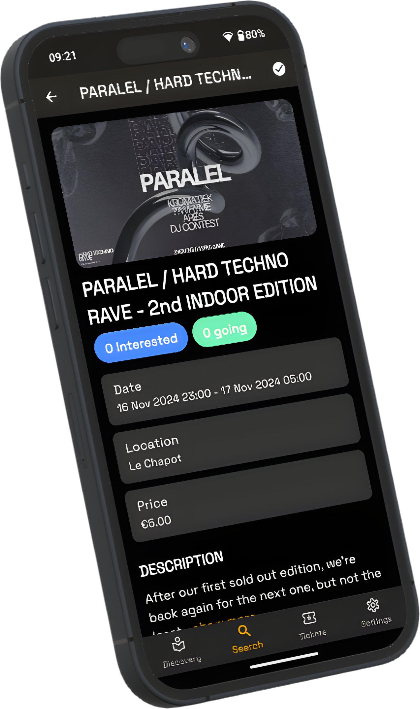

# Sway

## Project Description

Sway is a mobile event management application that helps users discover,
organize, and manage events effortlessly. Sway aims to provide a seamless and
intuitive experience for both event attendees and promoters.

## Screenshots

## Roadmap

Migrated to [Canny](https://swayapp.canny.io/)

### Last Updates

- Fix event item display when location is missing
- Update Firebase packages and integrate Analytics & Crashlytics
- Fix following button widget connectivity issue
- Release 1.0.0 - Add app signing configuration for release

### Known Issues

- Residents don't need to be limited in modal bottom sheets
- (Notification) Ticket notification actions are not working
- (Notification) Ticket notification doesn't show the ticket on click
- (Notification) Remote notification preferences not linked to notification
  channels
- (Timetable) The day selection show days without artists programmed.
- (FIXED)(Ticketing) Delete white margins on PDF during import
- (FIXED)(Ticketing) Multiple pages PDF are not unpacked a multiple tickets
- (FIXED)(Ticketing) Multiple ticckets navigation for one event fixed.

See the [open issues](https://github.com/SwayLtd/Sway-App/issues) for a list of
proposed features (and known issues).

## Multi-platform

Currently under development for Android and iOS. A Web, MacOS, iPadOS, Windows
version will be adapted in the future.
