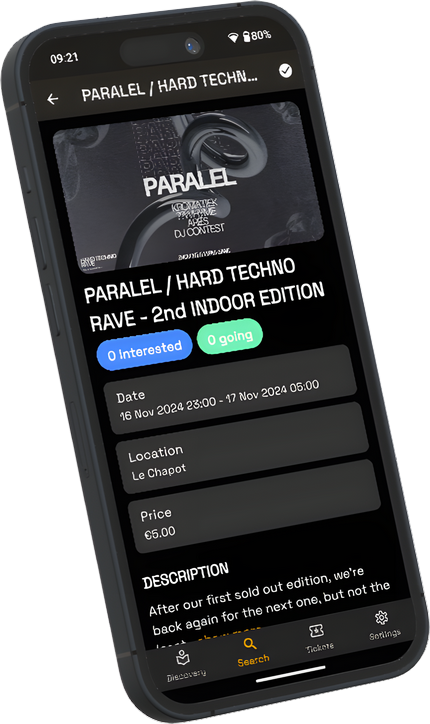

# Sway

## Project Description

Sway is a mobile event management application that helps users discover,
organize, and manage events effortlessly. Sway aims to provide a seamless and
intuitive experience for both event attendees and promoters.

## Screenshots

## Roadmap

Migrated to [Canny](https://swayapp.canny.io/)

### Last Updates

- Global filters, specific entities filters and proximity and city events and venues filters
- Implement new search system with filters
- Remove google_fonts dependency and add SpaceGrotesk font family locally
- Add "Map" button on scroll on Explore screen
- Implement location permission handling and update map center based on current location
- Add date filtering for events and current location layer to map screen
- Improve map marker interaction with event image display and navigation
- Change with light and dark mode with new map theme and disable rotation interaction option and remove of the blue circle layer
- Implement event map navigation
- Release 1.0.3 - Map and advanced search features

### Known Issues

- (Timetable) Shift to right of grid view if only one stage or artist to be displayed on timetable (only follower artist: true)
- Residents don't need to be limited in modal bottom sheets
- (Notification) Ticket notification actions are not working
- (Notification) Ticket notification doesn't show the ticket on click
- (Notification) Remote notification preferences not linked to notification
  channels

See the [open issues](https://github.com/SwayLtd/Sway-App/issues) for a list of
proposed features (and known issues).

## Multi-platform

Currently under development for Android and iOS. A Web version will be adapted
in the future.